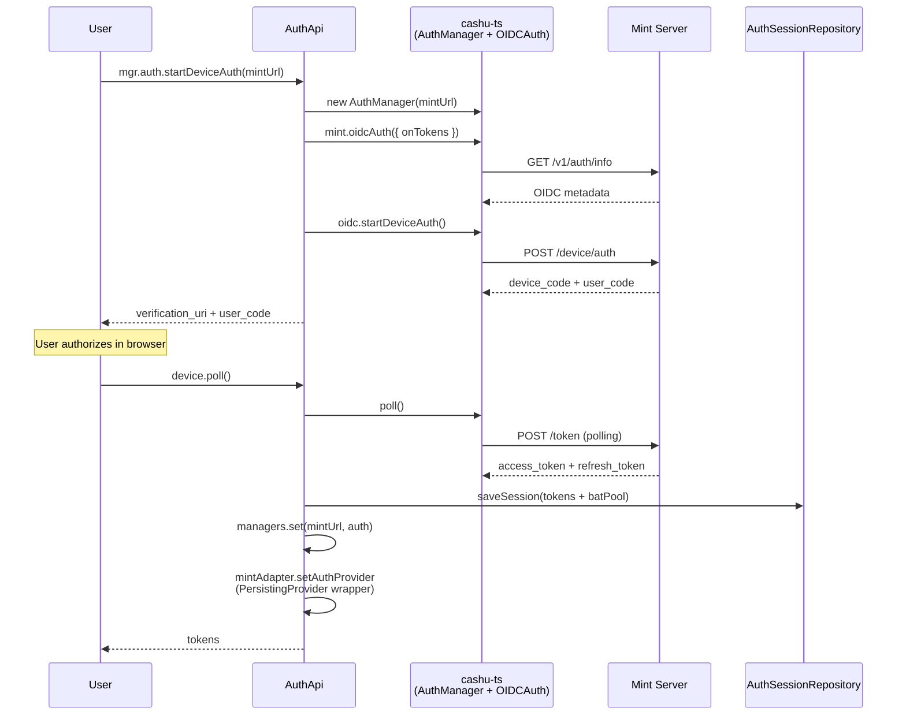
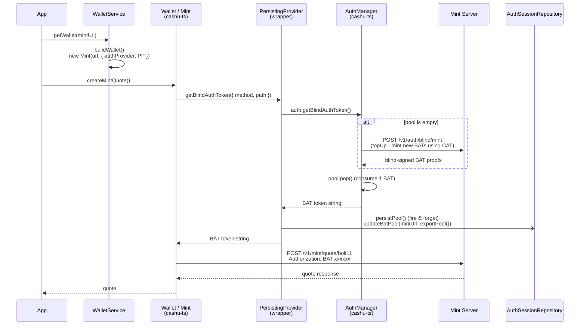
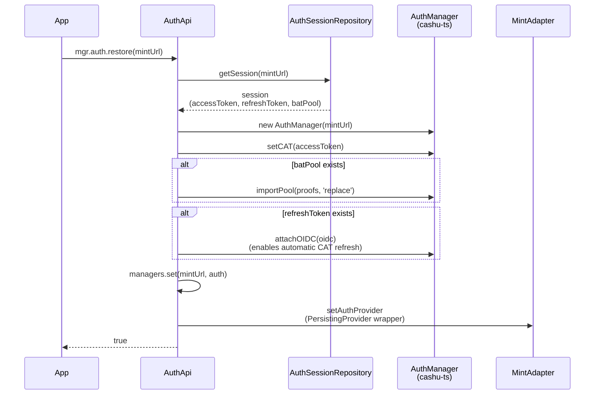
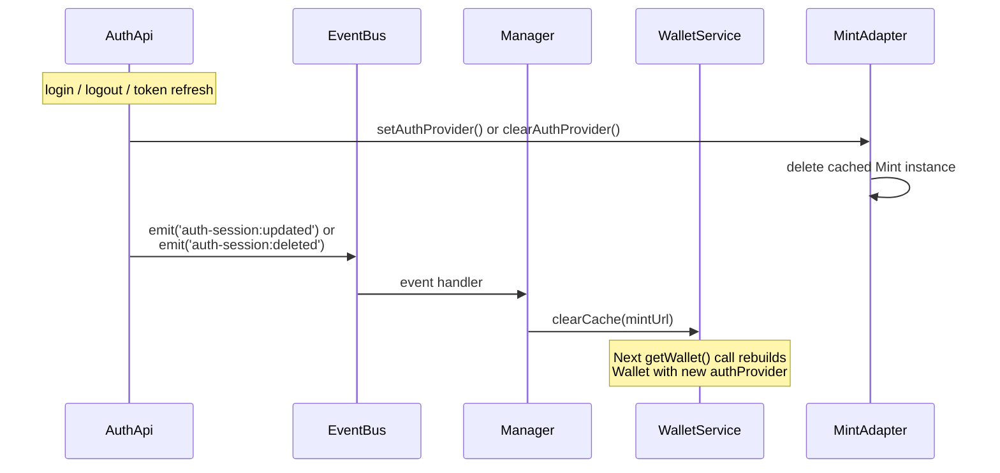
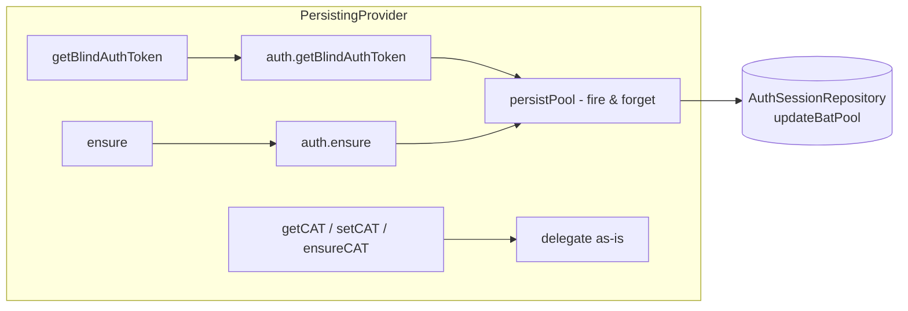
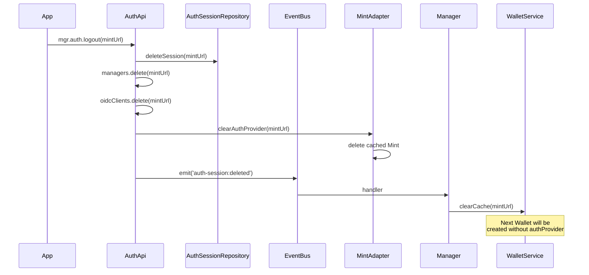
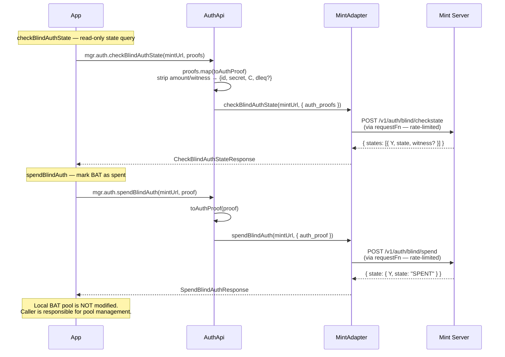

# NUT-21/22 Auth System Architecture

## Core Concepts

```
CAT (Client Auth Token) = OIDC access_token. User identity proof.
BAT (Blind Auth Token)   = ecash proof (unit:'auth', amount:1). Consumed per request.
                           Blind signature prevents mint from tracking "who made the request".
```

## Layer Structure

```
Manager (entry point)
  ├── mgr.auth.*          AuthApi
  ├── mgr.quotes.*        QuotesApi
  ├── mgr.wallet.*        WalletApi
  └── mgr.mint.*          MintApi

Services (business logic)
  ├── AuthSessionService   Session CRUD + expiry validation
  ├── WalletService        Wallet creation / caching
  └── MintService          Mint info management

Infra (external communication)
  ├── MintAdapter          HTTP -> Mint object management
  └── MintRequestProvider  Request rate limiting

Repositories (storage)
  └── AuthSessionRepository  memory / sqlite / indexeddb

cashu-ts (external library)
  ├── AuthManager          CAT/BAT lifecycle management
  ├── OIDCAuth             OIDC Device Code Flow
  ├── Mint                 Mint HTTP client
  └── Wallet               ecash operations (swap, melt, etc.)
```

## Storage Separation

```
Regular ecash:  /v1/keysets -> KeysetRepository
                Wallet      -> ProofRepository (unit:'sat')

Auth (BAT):    /v1/auth/blind/keysets -> cashu-ts internal
               AuthManager.exportPool() -> AuthSession.batPool (Proof[])
               <-> AuthSessionRepository (JSON serialized)
```

BAT is `unit:'auth'` and must not mix with balance.
When a session is deleted, BATs are deleted together.

---

## Flow 1: Initial Authentication (`startDeviceAuth`)



## Flow 2: Authenticated Request (`createMintQuote`)



## Flow 3: App Restart (`restore`)



## Flow 4: Cache Invalidation



## PersistingProvider Wrapper

cashu-ts `AuthManager` has no pool-change callback.
The wrapper intercepts `getBlindAuthToken()` and `ensure()` to auto-save pool to DB.



## Flow 5: Logout



## Flow 6: BAT State Query & Spend (non-standard cdk extension)

cashu-ts `Mint` class has no corresponding methods for these endpoints.
`MintAdapter` calls `requestProvider.getRequestFn()` directly.



### Wire Types (`packages/core/types.ts`)

```
Proof (cashu-ts)          AuthProof (wire)
┌──────────────────┐      ┌──────────────────┐
│ id               │ ──── │ id               │
│ amount           │  ✗   │ secret           │
│ secret           │ ──── │ C                │
│ C                │ ──── │ dleq? {e, s, r}  │
│ witness          │  ✗   └──────────────────┘
│ dleq? {e, s, r}  │ ────   toAuthProof() strips amount + witness
└──────────────────┘
```

## Recommended Mint Auth Configuration

```
# Entry points — authenticated users only
mint:              Blind   # Token minting requires BAT
get_mint_quote:    Clear   # Quote creation requires CAT (lightweight)
check_mint_quote:  Blind   # Quote status requires BAT

# Exit points — open (external recipients must redeem)
melt:              None    # Anyone with tokens can withdraw
get_melt_quote:    None    # Anyone can create withdrawal quotes
check_melt_quote:  None    # Anyone can check withdrawal status

# Token operations — open (receivers need swap to claim)
swap:              None    # Receiving tokens requires swap
check_proof_state: None    # Anyone can verify token validity

# Recovery — protected (computationally expensive, DoS vector)
restore:           Blind   # Token recovery requires BAT
```

Rationale: Mint serves two user types.
**Internal** (authenticated) users deposit funds via mint endpoints.
**External** users receive ecash and must be able to redeem (melt/swap) without authentication.

## Integration Test Suite

File: `packages/core/test/integration/auth-bat.test.ts`

```bash
MINT_URL=http://localhost:8085 bun test packages/core/test/integration/auth-bat.test.ts --timeout 300000
```

Requires OIDC Device Code authorization in browser during `beforeAll`.

```
beforeAll
  OIDC Device Code Flow → browser authorization → CAT acquired

T1  CAT-protected endpoint succeeds without consuming BATs
    createMintQuote (get_mint_quote = Clear)
    → quote returned, pool stays 0
    Verifies: CAT header auth works, BAT pool untouched

T2  ensure() mints BATs via CAT and populates pool
    provider.ensure(3)
    → pool ≥ 3
    Verifies: CAT → POST /v1/auth/blind/mint → BAT minting works

T3  session restore → CAT works, BAT re-mintable
    new Manager + restore() from same repository
    → createMintQuote succeeds (CAT restored)
    → ensure(2) succeeds (BAT re-mintable with restored CAT)
    Verifies: session persistence, CAT + BAT capability after restart

T4  flush → re-issue → checkBlindAuthState → spendBlindAuth
    importPool([], 'replace') → ensure(3) → fresh pool
    → checkBlindAuthState: all UNSPENT, pool size unchanged (read-only)
    → spendBlindAuth(pool[0]): returns SPENT
    → checkBlindAuthState: pool[0] SPENT, rest UNSPENT
    Verifies: checkstate/spend endpoints, state transitions, read-only semantics
```
