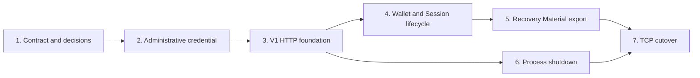

# Cocod Network Interface Delivery Slices

These documents split the [Cocod Network Interface v1](../network-interface-v1.md) into focused,
reviewable pull requests. Every slice must leave the CLI usable, keep the build green, and test
behavior through the module interface introduced or changed by that slice.

## Slices

1. [Contract and decisions](./01-contract-and-decisions.md)
2. [Shared administrative credential](./02-shared-administrative-credential.md)
3. [V1 HTTP foundation and status](./03-v1-http-foundation-and-status.md)
4. [V1 Wallet and Coco Session lifecycle](./04-v1-wallet-and-session-lifecycle.md)
5. [Wallet Recovery Material export](./05-wallet-recovery-material-export.md)
6. [Authenticated process shutdown](./06-authenticated-process-shutdown.md)
7. [TCP cutover](./07-tcp-cutover.md)

## Cross-slice constraints

- Do not combine adjacent slices merely because they touch the same files.
- Do not introduce a second transport; the Unix listener remains until slice 7 and is then removed.
- Keep one Wallet per Cocod Process for the first interface version.
- Do not expose Coco `Manager` objects or persistence models directly.
- Do not redesign quote or operation semantics owned by Coco.
- Do not add hypothetical credential or transport adapters; v1 has one opinionated implementation.
- Specify balances, mints, quotes, and operations only after these lifecycle slices are accepted.
